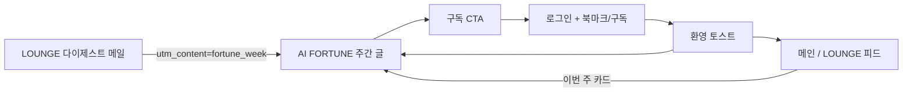

# Retention loop — LOUNGE 다이제스트 ↔ AI FORTUNE

주간 AI FORTUNE과 LOUNGE 이메일 다이제스트를 연결해 재방문·구독 전환을 돕는 루프입니다.

## 흐름

## Phase 1 — 연결

| 단계 | 구현 |
|------|------|
| 다이제스트 → FORTUNE | `src/app/api/cron/news-digest/route.ts` 하단 섹션, 최신 `AI_FORTUNE` 링크 + `utm_content=fortune_week` |
| FORTUNE → 구독 | `FortuneDigestSubscribeCta.tsx` — 비구독·게스트, Google OAuth + `aisle:pending-news-subscribe` |
| 로그인 환영 | `RetentionWelcomeToast.tsx` — 북마크 병합 또는 구독 완료 후 비차단 스낵바 |
| 메인 카드 | `HomeFortuneCard.tsx` — 홈·LOUNGE 탭 상단 |
| GA4 | `docs/ga4-events.md` — 클라이언트 이벤트 + 메일 UTM |

## Phase 2 — 습관

| 항목 | 구현 |
|------|------|
| 다이제스트 선정 | 동일 본문: 구간 내 LOUNGE `likeCount` 1위 + 나머지 최신순 + BUILD/LAUNCH 에디터 픽 1건 (`pickDigestLoungePosts`) |
| FORTUNE 아카이브 | `/?category=AI_FORTUNE` — `aiFortuneWeekKey` 내림차순, 「이번 주」/「지난 주차」 구분 |
| MBTI 딥링크 | `/post/{id}#INTJ` — `AiFortuneMbtiHashScroll` 스크롤·하이라이트 |

## Phase 3 (보류)

- 크론 Slack 알림: env 웹훅 없으면 미구현

## 운영

- 다이제스트: `.github/workflows/news-digest-kst.yml`
- AI FORTUNE 생성: `.github/workflows/ai-fortune-weekly-kst.yml`
